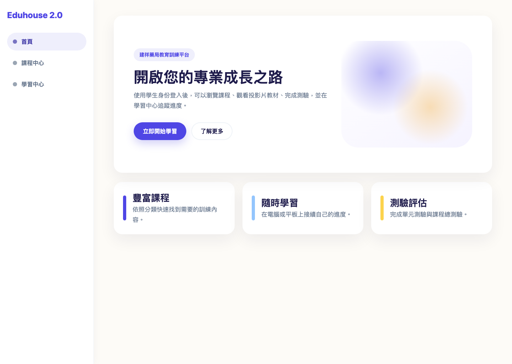
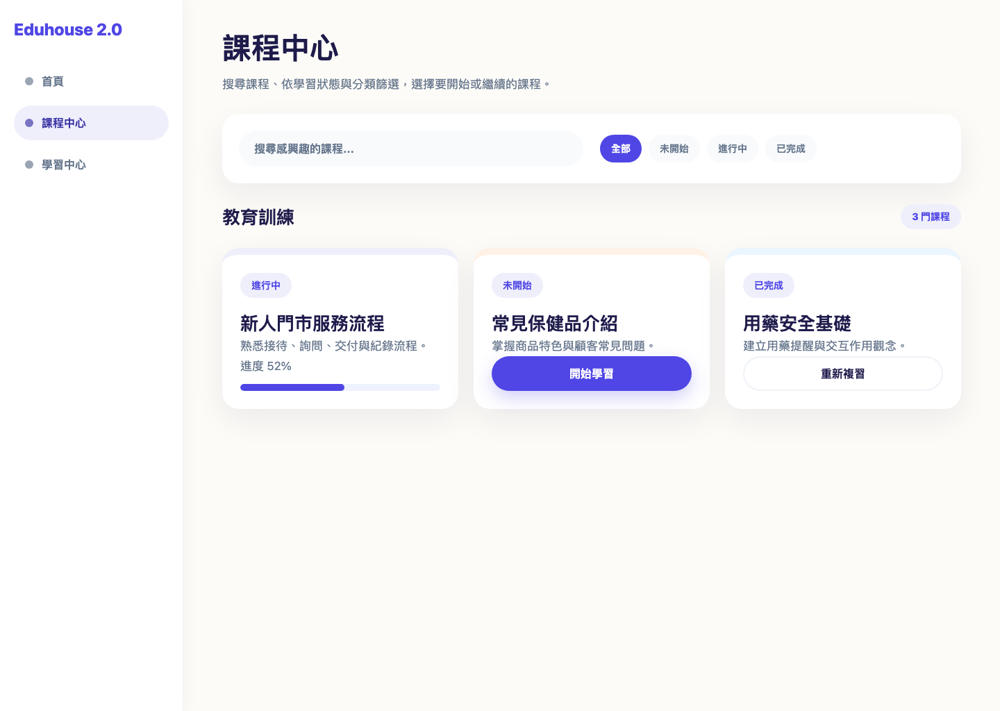
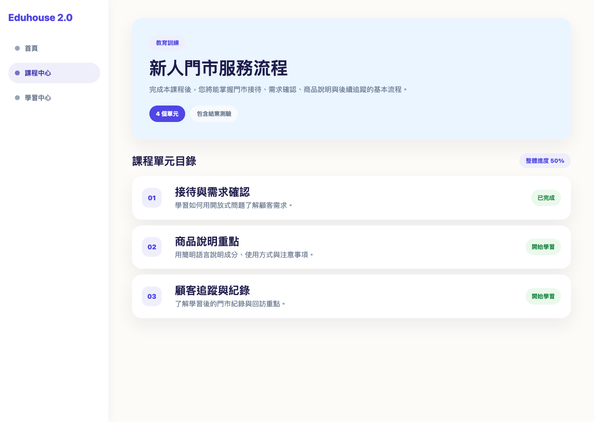
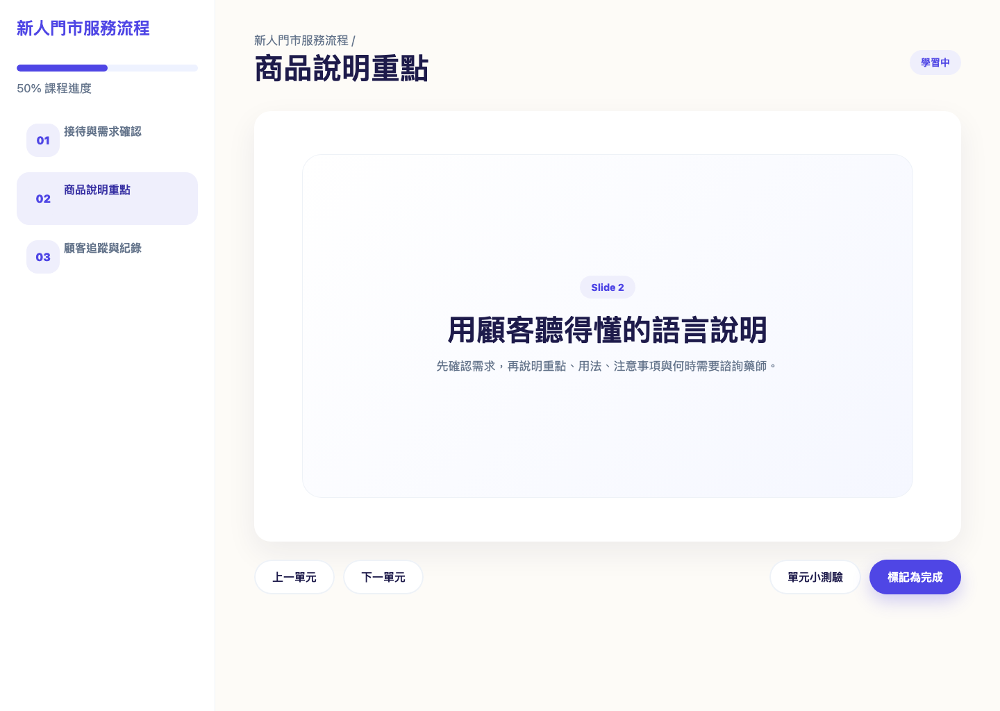
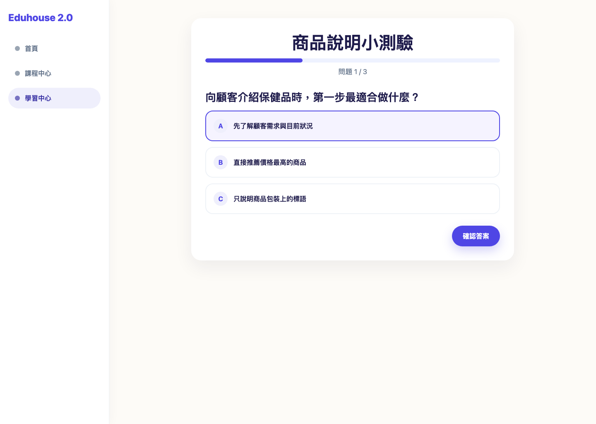
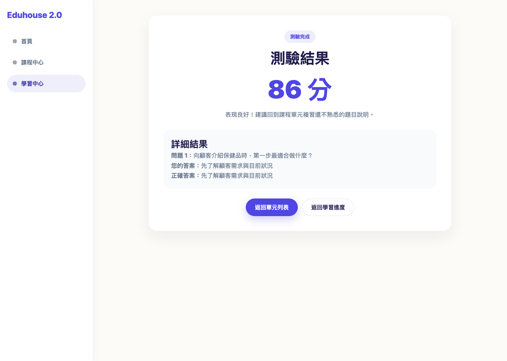

# 教育訓練平台學生使用說明

適用身份：Student / 學員  
適用情境：登入教育訓練平台、瀏覽課程、觀看教材、完成測驗、追蹤學習進度。

> 本文件為學生端操作指南。截圖為操作示意，實際課程名稱、分類、測驗題目與進度會依系統資料而不同。

## 1. 登入與首頁

進入平台後，首頁會顯示教育訓練平台入口。學生可點選「立即開始學習」登入，或已登入時直接進入課程中心。

操作重點：

1. 使用學生帳號登入平台。
2. 登入後可從側邊欄進入「課程中心」或「學習中心」。
3. 若登入失敗，請確認帳號權限，或聯繫管理者協助。

## 2. 瀏覽課程中心

「課程中心」是尋找訓練內容的主要頁面。學生可以用搜尋框、學習狀態與分類快速找到課程。

可使用的篩選方式：

- 搜尋課程：輸入課程名稱或關鍵字。
- 學習狀態：切換「全部」、「未開始」、「進行中」、「已完成」。
- 類別篩選：依教育訓練、商品教育、IG/電子報等分類查看課程。

課程卡片上的按鈕會依進度顯示：

- 「開始學習」：尚未開始的課程。
- 「繼續學習」：已開始但尚未完成的課程。
- 「重新複習」：已完成的課程。

## 3. 查看課程詳情與單元目錄

點選課程後會進入課程詳情頁。此頁會顯示課程說明、單元數量、是否包含測驗，以及所有單元列表。

操作步驟：

1. 閱讀課程描述，確認此課程的學習目標。
2. 從「課程單元目錄」選擇要學習的單元。
3. 已完成的單元會顯示完成狀態，可隨時重新進入複習。
4. 若課程包含總測驗，可在完成學習後進行測驗。

## 4. 觀看教材與完成單元

進入單元後，畫面左側會顯示課程單元列表與進度，右側會顯示投影片教材。

學習操作：

1. 使用投影片區域閱讀教材內容。
2. 透過「上一單元」與「下一單元」切換章節。
3. 若單元有小測驗，可點選「單元小測驗」。
4. 完成閱讀後，點選「標記為完成」，系統會更新學習進度。

注意事項：

- 建議依照單元順序完成課程，避免漏看必要內容。
- 若投影片中有外部連結或影片，可依畫面提供的入口開啟。
- 標記完成後仍可返回課程重新複習。

## 5. 進行測驗

測驗頁會逐題顯示問題與選項。選擇答案後，點選「確認答案」，再進入下一題。

作答流程：

1. 閱讀題目。
2. 點選最適合的答案選項。
3. 點選「確認答案」查看回饋。
4. 點選「下一題」繼續作答。
5. 最後一題完成後，系統會顯示測驗結果。

## 6. 查看測驗結果

完成測驗後，系統會顯示分數、回饋與答題明細。若分數不理想，可返回課程重新複習。

結果頁可以協助學生：

- 確認本次測驗分數。
- 查看答對與答錯的題目。
- 閱讀正確答案與解釋。
- 返回單元列表或學習進度頁。

## 7. 查看學習中心

「學習中心」會整理學生已開始的課程與整體進度。學生可從此處快速回到尚未完成的單元。

建議使用方式：

1. 定期查看整體完成率。
2. 展開課程進度，確認哪些單元已完成。
3. 針對測驗分數較低的單元重新複習。
4. 完成所有單元後，再進行課程總測驗。

## 8. 常見問題

### 看不到課程怎麼辦？

請先確認是否已登入學生帳號。如果仍看不到課程，可能是課程尚未上架，請聯繫管理者確認。

### 為什麼我的進度沒有更新？

請確認已點選「標記為完成」。如果網路中斷或頁面停留太久，建議重新整理後再次確認。

### 測驗可以重做嗎？

依目前平台流程，學生可重新進入課程與測驗複習。實際是否採計最新分數，請依管理者公告為準。

### 手機可以使用嗎？

平台支援響應式畫面，但建議使用電腦或平板觀看投影片與作答，閱讀體驗會更完整。

## 9. 學習建議

- 每次學習一個單元，完成後立即標記完成。
- 單元小測驗用來確認理解，答錯時先回到教材複習。
- 課程總測驗前，先到學習中心確認所有單元是否已完成。
- 若遇到內容疑問，記下課程名稱與單元名稱，方便向主管或管理者詢問。
